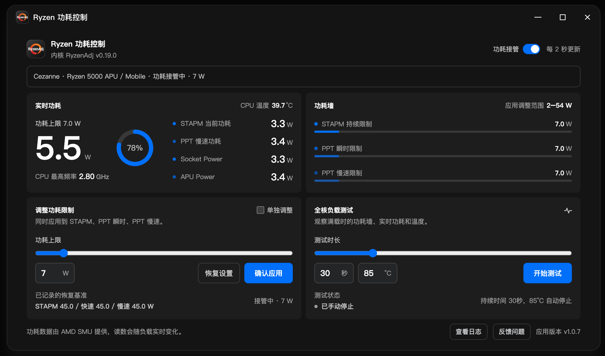
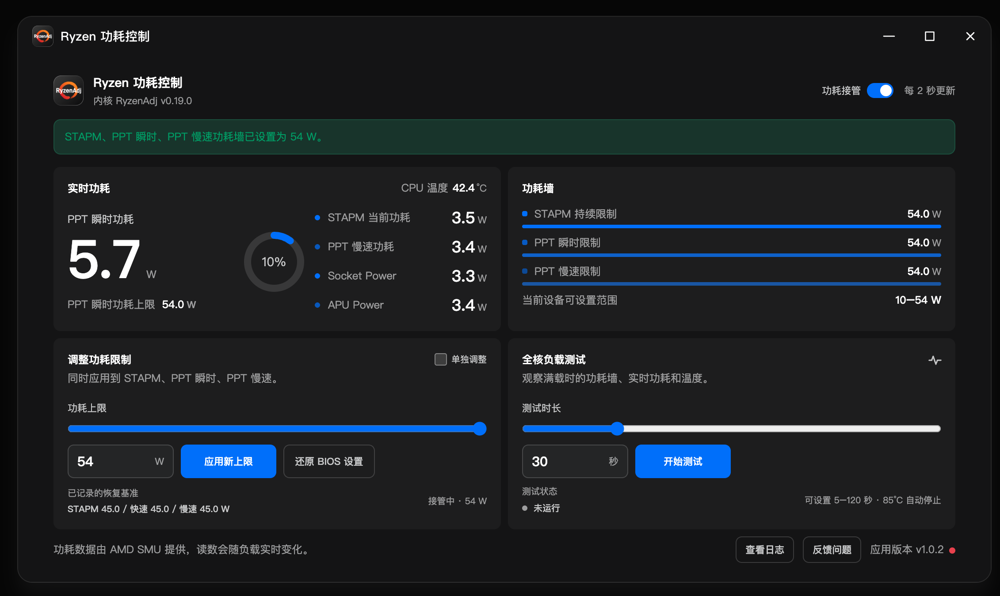

# Ryzen 功耗控制（fnOS）

通过 RyzenAdj 读取 Ryzen APU 的 SMU 功耗墙、实时功耗和温度，设置或恢复 STAPM / PPT Fast / PPT Slow 限制，并运行限时全核负载。

## 应用截图

## 安装与使用

1. 在飞牛应用中心选择“手动安装”，打开 `ryzen-power-control.fpk`。
2. 从桌面打开“Ryzen 功耗控制”。只有管理员可以访问控制接口。
3. 输入应用调整范围内的整数并应用，会同时设置三项功耗墙。最低可输入 2W，该值是应用下限；能否生效由设备固件决定。写入后会回读校验，不一致时提示错误且不保存为目标功耗。
4. “恢复记录值”会恢复应用首次启动时读取到的三项限制。
5. 负载测试提供 30、60、120 秒全核测试，可手动停止；CPU 温度达到填写的停止温度会自动停止，默认 85°C，可设置 40–95°C。

## 界面

界面从 fnOS 桌面读取飞牛自身的颜色和控件主题变量，亮暗模式会随系统切换。主题变量只在本机应用窗口内读取，不依赖外部资源。

功耗墙设置经 AMD SMU 写入，仅在当前开机周期内有效。重启后由 BIOS 重新接管；应用启动本身不会修改功耗墙。

## 已验证环境

- fnOS x86，Linux 6.18.18
- AMD Ryzen 7 5800H（Cezanne），BIOS 605
- RyzenAdj v0.19.0

应用以 root 运行以访问 `/dev/mem`。包内包含 RyzenAdj Linux x86_64 程序及其许可证；`libpci.so.3`、`libudev.so.1` 由 fnOS 提供。其他 CPU 和 BIOS 配置尚未验证。

## 功耗读取自动修复

应用优先通过 `ryzen_smu` 读取功耗表。如果驱动缺失、不兼容或读取失败，使用随包的 `ryzen_smu` 0.1.7 源码，为当前内核编译并重新加载驱动，再重试读取。只有驱动修复仍失败时才回退到 `/dev/mem`。每次应用启动最多修复一次；实际读取路径、修复过程和失败原因保存在“查看日志”中。

运行日志支持手动清理，应用日志文件每 24 小时自动清空一次；手动清理后重新计时。系统内核日志在查看时读取，不清理系统日志。

需要当前内核对应的 `/lib/modules/$(uname -r)/build` 构建文件、`gcc`、`make` 和 `insmod`。缺少条件或内核拒绝加载时，应用明确显示修复失败原因。驱动在应用数据目录中构建，重启后由应用按需重新加载，内核升级后针对新版本重新编译。

驱动源码来自 [amkillam/ryzen_smu](https://github.com/amkillam/ryzen_smu)，固定提交 `d2983668300dd2a598e5a7dc40e71ce0678cc270`，按 GPL-2.0 随包提供源码及许可证。

随包的 RyzenAdj 增加了 `RYZENADJ_BACKEND=smu|mem` 后端选择，用于执行上述读取顺序；对应修改后的源码及构建步骤在 `app/RYZENADJ-SOURCE.tar.gz` 中。
